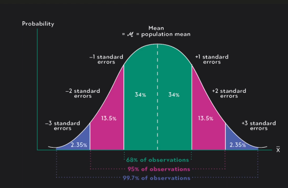
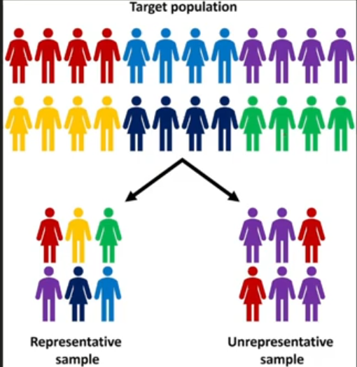

# 1. What is Statistics?

---

**Statistics** is the branch of mathematics that deals with:

* **Collecting** data
* **Organizing** data
* **Analyzing** data
* **Interpreting** data
* **Presenting** data

> **Statistics helps us to make sense of data.**

In **Data Science**, we use statistics to:

* For finding patterns in data
* For summarizing large datasets into simple numbers (like averages)
* For making predictions based on sample data
* For making decisions under uncertainty

---

# 2. Scales of Measurements

There are **4** type of Scales (levels):

### 2.1. Nominal (Name only)

* **Just names** or **labels**.
* **No order**, just different categories.
* **Example**:

  * Colors: Red, Blue, Green
  * Gender: Male, Female

> We cannot say "Red is greater than Blue." They are just different names.

---

### 2.2. Ordinal (Order matters)

* **Names + Order**.
* There **is a ranking**, but **you don't know the exact difference** between them.
* **Example**:

  * Ranking: 1st place, 2nd place, 3rd place
  * Rating: Bad, Okay, Good, Excellent

> We know who is first or second, but **not by how much**.

---

### 2.3. Interval (Order + Equal Gaps)

* **Numbers** where:

  * Order matters.
  * The **gap** between numbers **is equal**.
  * **BUT** no true zero (zero doesn't mean 'nothing').
* **Example**:

  * Temperature (0°C doesn't mean "no temperature")
  * Calendar years (2000, 2020, 2024)

> 🌡️ 20°C is warmer than 10°C, and the difference between 20°C and 30°C is the same as 30°C to 40°C.

---

### 2.4. Ratio (Order + Equal Gaps + True Zero)

* **Everything in interval**, **plus** a **true zero**.
* True zero = "nothing."
* **Example**:

  * Weight
  * Age
  * Height
  * Money

> If someone has 0 kg weight, it really means no weight at all!

---

**Summary:**

| Level    | Example              | Notes                            |
| -------- | -------------------- | -------------------------------- |
| Nominal  | Red, Blue            | Names only                       |
| Ordinal  | Small, Medium, Large | Order, but no exact gaps         |
| Interval | Temperature (°C)     | Order + Equal Gaps, no true zero |
| Ratio    | Weight, Age          | Order + Equal Gaps + True Zero   |

---

# 3. Types of Data

In statistics, **data** is mainly divided into two big types:

| Type              | Meaning                                   | Example                     |
| ----------------- | ----------------------------------------- | --------------------------- |
| Qualitative Data  | Describes **qualities** or **categories** | Color, Gender, Nationality  |
| Quantitative Data | Describes **numbers** or **amounts**      | Age, Height, Weight, Salary |

---

## 3.1. Qualitative Data (also called **Categorical Data**)

* Deals with **words**, **labels**, or **descriptions**.
* No numbers involved.
* **Examples**:

  * Eye Color: Brown, Blue, Green
  * Marital Status: Single, Married
  * Favorite Food: Pizza, Burger

> We **cannot do math** on qualitative data (you can’t add "red" + "blue").

---

## 3.2. Quantitative Data (Numerical Data)

* Deals with **numbers** and **amounts**.
* You **can do math** with it (like adding, averaging).
* **Examples**:

  * Age: 18 years
  * Salary: \$5000
  * Height: 170 cm

---

## 3.2.1. Quantitative Data is Further Divided

| Type            | Meaning                       | Example                           |
| --------------- | ----------------------------- | --------------------------------- |
| Discrete Data   | **Whole numbers only**        | Number of students (5, 10, 20)    |
| Continuous Data | **Any value (even decimals)** | Weight: 65.5 kg, Height: 172.3 cm |

**Discrete** = Countable
**Continuous** = Measurable

---

**Summary:**

| Main Type    | Sub-Types            | Example                    |
| ------------ | -------------------- | -------------------------- |
| Qualitative  | —                    | Colors, Gender, City       |
| Quantitative | Discrete, Continuous | Number of students, Weight |

---

**Main Idea:**

> **Qualitative** = What kind?
> **Quantitative** = How much?

---

# 4. Time Series Data

* Data collected **over time** (ordered by time).
* **Time matters** — we care about *when* the data was recorded.
* **Examples**:

  * Stock prices **every day**
  * Temperature readings **every hour**
  * Sales numbers **every month** 🛒

**Time is important** here.

---

# 4. Spatial Data

* Data related to **location** or **position**.
* **Where** matters, not just the value.
* **Examples**:

  * GPS coordinates (latitude, longitude)
  * Mapping city locations on Google Maps
  * Satellite images

**Location is important** here.

---

# 5. Multivariate Data

* Data that has **more than one variable** for each observation.
* **Multi** means **many**.
* **Examples**:

  * A student's record: (Age, Height, Weight, Marks)
  * Weather data: (Temperature, Humidity, Wind speed)

**Multiple features** describing each object.

---

# 6. Structured vs Unstructured Data

| Type              | Meaning                                 | Example                        |
| ----------------- | --------------------------------------- | ------------------------------ |
| Structured Data   | **Organized in tables** (rows, columns) | Excel files, Databases (SQL)   |
| Unstructured Data | **Not organized** (random text, images) | Photos, Videos, Emails, Tweets |

Structured = Like neat, clean tables
Unstructured = Like messy documents

---

# 7. Boolean Data

* Data that can only have **two possible values**:

  * **True / False**
  * **Yes / No**
  * **0 / 1**

**Examples**:

* Is student enrolled? (Yes or No)
* Is the light on? (True or False)
* Did it rain today? (1 or 0)

Only **two outcomes**.

---

# 8. Operationalization

**Meaning:**

> **Turning ideas or concepts into measurable things.**

When we want to study something abstract (like "happiness", "intelligence", "success"),
we **cannot** directly measure it.
So we **operationalize** it — meaning:
We **decide how we will measure it** in the real world.

---

**Examples:**

| Concept      | How to Operationalize       | Example                |
| ------------ | --------------------------- | ---------------------- |
| Happiness    | Score on a happiness survey | Survey of 10 questions |
| Intelligence | IQ Test result              | Standard IQ Test score |
| Fitness      | Time to run 1km             | Stopwatch the 1km race |

---

**Key Point**:

* Concept (abstract) → Measurable method (real-world)

---

# 9. Proxy Estimation

**Meaning:**

> **Using something else as a substitute (proxy) to estimate what we cannot directly measure.**

Sometimes we **cannot directly measure** a thing (maybe it's too hard, too costly, or impossible).
So we use **another related thing** as a **proxy**.

---

**Examples:**

| What we really want to know | Proxy we use instead  | Why?                              |
| --------------------------- | --------------------- | --------------------------------- |
| Wealth of a person          | Number of luxury cars | Easier to observe                 |
| Education quality           | Average test scores   | Test scores are measurable        |
| Health of a city            | Number of hospitals   | Direct health data is hard to get |

---

**Summary:**

| Term               | Meaning                                  | Example                    |
| ------------------ | ---------------------------------------- | -------------------------- |
| Operationalization | Making an idea measurable                | Happiness → Survey score   |
| Proxy Estimation   | Using something else to estimate a value | Wealth → Luxury cars owned |

---

# 10. What is a Surrogate Endpoint?

> A **surrogate endpoint** is a **substitute measurement** used in place of the real outcome that we actually care about — because it's **easier, faster, or cheaper** to measure.

---

**Why do we use surrogate endpoints?**

* The real outcome takes **too long** to happen.
* The real outcome is **too expensive** or **too difficult** to measure.
* We want to make **faster decisions** in studies or experiments.

---

**Examples:**

| Real Outcome (takes time) | Surrogate Endpoint (measured faster) | Why surrogate?                                 |
| ------------------------- | ------------------------------------ | ---------------------------------------------- |
| Death from heart disease  | Blood pressure level                 | Easier to measure BP than waiting for deaths   |
| Long-term cancer survival | Tumor size shrinkage after 2 months  | Tumor shrinkage shows if treatment works early |
| Diabetes complications    | Blood sugar levels                   | High blood sugar leads to complications later  |

---

**Key Point:**

* **Surrogate** = A **shortcut measurement**
* It **predicts** what might happen later without waiting forever.

---

**Important Note:**

* **Good surrogate endpoints** are strongly **correlated** with real outcomes.
* **Bad surrogates** might mislead! (They seem good but don't actually predict the true result.)

---

**If correlation is high**, Blood Pressure is a **good surrogate** for Heart Disease.
**If correlation is low**, it's **not reliable**.

---

**Summary:**

| Term               | Meaning                                                  | Example                                             |
| ------------------ | -------------------------------------------------------- | --------------------------------------------------- |
| Surrogate Endpoint | Shortcut measurement instead of waiting for real outcome | Blood pressure instead of waiting for heart disease |

---

**In Short:**

Surrogate Endpoint = **Shortcut for prediction**
Use when **waiting** is **too long** or **too costly**
But **always check** if it's a **good predictor**!

---

# 11. True Score Theory: X = T + E

> Every **measured value (X)** is made up of:
>
> * a **True Score (T)** → the real, perfect value
> * plus **Error (E)** → mistakes, noise, or random errors.

---

**Formula:**

$$
X = T + E
$$

Where:

* **X** = what we actually measure (Observed Score)
* **T** = True Score (perfect reality if no mistakes)
* **E** = Error (all random mistakes, noise, distractions, etc.)

---

**Examples:**

Imagine you are measuring your **weight** on a **scale**:

| Item                | Value                              |
| ------------------- | ---------------------------------- |
| True weight (T)     | 70 kg                              |
| Scale error (E)     | +1.5 kg (maybe the scale is wrong) |
| Measured weight (X) | 71.5 kg                            |

See?
Your real weight is 70kg,
but because of a small error (1.5kg),
the scale shows 71.5kg.

---

**Why is this important?**

* **In Data Science, Statistics, Surveys, etc.**:
  You **never** have 100% perfect data.
* **There’s always some error** — random mistakes, misunderstanding, poor measuring tools, etc.
* **We aim to reduce E** (error) as much as possible to get close to **T** (true).

---

**Summary:**

| Term               | Meaning                          | Example                   |
| ------------------ | -------------------------------- | ------------------------- |
| True Score (T)     | Real value without mistakes      | Your exact weight 70kg    |
| Error (E)          | Random noise/mistakes            | Scale wrongly adds +1.5kg |
| Observed Score (X) | What we actually measure (T + E) | 71.5kg                    |

---

**In Short:**

**X = T + E**
**T** = What we **want**
**E** = What we **don't want** (mistakes, noise)
**X** = What we **actually get**

---

# 12. Types of Errors in Data Collection

When we collect data, **mistakes** can happen.
**These mistakes are called "errors."**
There are two **main types**:

---

## 12.1. **Random Error**

**Definition:**

> Errors that happen **by chance**, not because of anything specific.

* **Small**, **unpredictable** mistakes.
* They are **natural** and **unavoidable**.
* They usually **balance out** if you collect a lot of data.

**Examples:**

* A person **accidentally** misreads a survey question.
* A scale showing **+0.5kg** extra because of air pressure.
* Typing a wrong number **by mistake**.

---

## 12.2. **Systematic Error**

> Errors that happen because of a **consistent problem** in the system.

* **Same mistake** happens again and again.
* **Very dangerous** because it **biases** your results.
* It **does not balance out** even with more data.

**Examples:**

* A weighing machine is **always 2kg wrong**.
* A survey question is **badly worded** and **confuses** everyone.
* A sensor **always** reads **too low** because of a calibration problem.

---

**Summary**

| Type of Error    | Key Idea                        | Example                           |
| ---------------- | ------------------------------- | --------------------------------- |
| Random Error     | Small, unpredictable mistakes   | Typo, random wrong reading        |
| Systematic Error | Consistent, repeatable mistakes | Faulty machine, bad survey design |

---

**Summary:**

| Concept          | Simple Meaning                                         |
| ---------------- | ------------------------------------------------------ |
| Random Error     | Mistakes that are unpredictable and balance out        |
| Systematic Error | Mistakes that are consistent and dangerous             |
| Other Errors     | Sampling, Measurement, Entry, Non-Response, Processing |

---

# 13. Type-1 Error (False Positive)

> Rejecting the **Null Hypothesis** when it is actually **true**.

**Simple Words:**

* You think something **happened**, but it **didn't**.
* **You wrongly detect** an effect.

**Example:**

* Doctor says you are **sick**, but you are actually **healthy**.

**Symbol:**

* Probability of Type-1 Error = **α** (alpha)

**Real-life Example:**

* A test shows **you have COVID** but you **don’t**.

---

# 14. Type-2 Error (False Negative)

> Failing to reject the **Null Hypothesis** when it is actually **false**.

**Simple Words:**

* You think **nothing happened**, but **something did**.
* **You miss** detecting an effect.

**Example:**

* Doctor says you are **healthy**, but you are actually **sick**.

**Symbol:**

* Probability of Type-2 Error = **β** (beta)

**Real-life Example:**

* A test says you **don't have COVID**, but you **do**.

---

**Summary**

| Error Type   | What Happens                       | Real-World Example                          |
| ------------ | ---------------------------------- | ------------------------------------------- |
| Type-1 Error | False Positive (Reject H₀ wrongly) | Doctor says you're sick, but you're healthy |
| Type-2 Error | False Negative (Accept H₀ wrongly) | Doctor says you're healthy, but you're sick |

---

**Summary:**

| Concept          | Meaning                                                    |
| ---------------- | ---------------------------------------------------------- |
| Type-1 Error (α) | Detecting something that's not there (False Alarm)         |
| Type-2 Error (β) | Missing something that's actually there (Missed Detection) |

---

**In Short:**

**Type-1** = **False Positive** (You cry "Wolf!" but no wolf 🐺)
**Type-2** = **False Negative** (A wolf comes but you say "No wolf" 🐺)

---

# 15. Reliability

> **Reliability** means: Are the results **consistent** every time?

**Simple words:**

* Same thing → same result → every time.
* **Stable and dependable** measurements.

**Example:**

* You weigh yourself 5 times in 10 minutes.
* If the scale shows **the same weight** every time, it’s **reliable**.

**If not reliable:**

* 1st time: 65kg, 2nd: 67kg, 3rd: 63kg — not reliable!

---

**Small standard deviation** = **High reliability**.

---

**Important:**

* A test can be **reliable** (consistent) but **not valid** (wrong).
* **Example:** A broken clock always shows 3:00 — very reliable but not valid!

---

# 16. Validity

> **Validity** means: Are you measuring **what you are supposed to measure**?
>
* Are you **correct**?
* Is the result **actually true**?

**Example:**

* A weight scale should measure **weight**, not **height**.
* If a depression test measures **mood**, it’s **valid**.
* If it accidentally measures **energy levels** instead, not valid!

---

# 17. Triangulation

> **Triangulation** means:
> **Using multiple methods, data sources, or people to study the same thing**, to make your results more **strong**, **trustworthy**, and **accurate**.

* Don’t just trust **one way** of collecting information.
* **Cross-check** it using different ways.
* Like **looking at a mountain from different sides** to understand it fully.

---

**Why Triangulation is Important?**

| Reason                   | Example                                            |
| ------------------------ | -------------------------------------------------- |
| Find the full picture    | Interviews + Surveys + Observations                |
| Reduce mistakes (errors) | If one method is wrong, others help catch it       |
| Increase confidence      | If different methods say same thing = trustworthy! |

---

## 17.1. Types of Triangulation

| Type                           | What it Means                            | Example                              |
| ------------------------------ | ---------------------------------------- | ------------------------------------ |
| **Data Triangulation**         | Use different data sources               | Survey students + teachers + parents |
| **Method Triangulation**       | Use different methods                    | Survey + Interview + Observation     |
| **Investigator Triangulation** | Different people collect data            | Two or more researchers              |
| **Theory Triangulation**       | Use different theories to interpret data | Psychological + Economic theories    |

---

**Quick Example (Simple Story)**

Suppose we are checking **how students feel about online classes**.

* We **survey** them (Method 1 📋).
* We **interview** them (Method 2 🎤).
* We **observe** their behavior in online class (Method 3 👀).

If **all three ways** show students are **happy**,
then we can **strongly trust** our conclusion!

**That's Triangulation!**

---

**Visualize It Like:**

> **One Eye** → Not full view 👁️
> **Three Eyes** → Full understanding 👁️👁️👁️

More **eyes** = **Better truth**.

---

**Summary:**

| Point | Summary                                  |
| ----- | ---------------------------------------- |
| What  | Triangulation = Multiple sources/methods |
| Why   | To improve accuracy, reduce error        |
| Types | Data, Method, Investigator, Theory       |
| Goal  | Strong, trustworthy results              |

---

# 18. Measurement Bias

> Measurement Bias happens when the method or tool used to **collect data** gives **incorrect** results again and again.

**Simple way to remember:**

> **Bad measuring = Bad data.**

---

**Effects of Measurement Bias**

* Wrong conclusions
* Wasted money and time
* Wrong decisions

---

**How to Reduce or Avoid Measurement Bias**

| Action                | Example                                     |
| --------------------- | ------------------------------------------- |
| Use calibrated tools  | Check and adjust machines regularly         |
| Train data collectors | Teach them proper methods                   |
| Write clear questions | Easy to understand, no confusion            |
| Pilot test tools      | Test your survey or machine before full use |

---

**Summary:**

| Topic            | Meaning                                   |
| ---------------- | ----------------------------------------- |
| Measurement Bias | Error caused by bad measurement           |
| Main Cause       | Bad tools, bad methods, unclear questions |
| How to Fix       | Use correct tools, training, testing      |

---

# 19. Types of Statistics

---

## 19.1. Descriptive Statistics

> Just **show** or **describe** what the data looks like.
> (No guessing, no predicting.)
>
**Examples:**

* Average height of students
* Most common color in a survey
* Highest score in an exam
* Standard deviation (spread of data)

**Common Tools:**

* **Mean** (Average)
* **Median** (Middle value)
* **Mode** (Most common value)
* **Range** (Difference between highest and lowest)
* **Standard Deviation** (How spread out numbers are)

---

## 19.2. Inferential Statistics

> **Use small data** (sample) to **guess about large data** (population).

**Examples:**

* Survey 100 people to predict the opinion of 10,000 people
* Test 50 patients to see if a new medicine works for millions
* Predict election results from sample votes

**Common Tools:**

* Hypothesis testing (ex: is a new drug better?)
* Confidence intervals (ex: 95% sure average salary is between \$40K and \$50K)
* Regression analysis (ex: predicting weight based on height)

---

**Real-Life Example**

| Situation  | Descriptive                          | Inferential                                         |
| ---------- | ------------------------------------ | --------------------------------------------------- |
| Class Test | Find the average score of your class | Predict how students in the whole school will score |

---

**Quick Summary**

* **Descriptive** = Just describe the data
* **Inferential** = Predict for bigger group

---

Alright! Let's keep it **simple**, **clear**, and **easy** — just like you're asking!

---

# Data Analysis and Types of Data Analysis

---

## 20. What is Data Analysis?

> **Data Analysis** means **organizing**, **cleaning**, **studying**, and **making sense** of the data to **find useful information** and **make decisions**.

In easy words:

* Look at the data
* Understand patterns
* Make smart conclusions

---

## - Types of Data Analysis

## 20.1. Descriptive Analysis

> Just **tell what happened**.

**Example:**

* "Sales increased by 20% last month."
* "Most students scored above 80%."

**Tools:**

* Averages
* Percentages
* Graphs (bar charts, pie charts)

---

## 20.2. Diagnostic Analysis

> **Find out why** something happened.

**Example:**

* "Sales increased because of a holiday discount."
* "Students scored low because of a tough paper."

**Tools:**

* Correlation analysis
* Drill-down reports
* Root cause analysis

---

## 20.3. Predictive Analysis

> **Guess what might happen** in the future.

**Example:**

* "Next month's sales will be even higher."
* "Students who study 2 hours daily will likely score 90+."

**Tools:**

* Machine learning
* Regression models
* Forecasting

---

## 20.4. Prescriptive Analysis

> **Suggest what we should do** next.

**Example:**

* "Offer more discounts to increase sales."
* "Organize study sessions for students."

**Tools:**

* Optimization techniques
* Recommendation systems
* Decision trees

---

**Summary Table**

| Type                  | Simple Meaning        | Example                      |
| --------------------- | --------------------- | ---------------------------- |
| Descriptive Analysis  | What happened?     | "Sales increased"            |
| Diagnostic Analysis   | Why did it happen? | "Because of discounts"       |
| Predictive Analysis   | What will happen? | "Sales will grow next month" |
| Prescriptive Analysis | What should we do? | "Offer more discounts"       |

---

> **Descriptive = What happened** |
> **Diagnostic = Why it happened** |
> **Predictive = What will happen** |
> **Prescriptive = What to do next**

---

# 21. What is Central Tendency?

> **Central Tendency** means finding the **middle** or **center** of your data.

In other words:

> Where are most of your numbers **grouped**?

---

# 22. Measures of Central Tendency

## 22.1. Mean (Average)

**Formula:**
➔ $\text{Mean} = \frac{\sum x_i}{n}$

where:

* $\sum x_i$ = sum of all values
* $n$ = total number of values

**Example:**

Data = \[10, 20, 30, 40, 50]

Mean = (10 + 20 + 30 + 40 + 50) / 5 = **30**

---

## 22.2. Median (Middle Value)

**Formula:**

* **Step 1:** Arrange values in **ascending order**.
* **Step 2:**

  * If $n$ is **odd**:

    $\text{Median} = \text{Middle value}$
  * If $n$ is **even**:

    $$
    \text{Median} = \frac{\text{Middle two values' sum}}{2}
    $$

**Example:**

Data = \[5, 10, 15]

Middle value = **10**

> *If even numbers, take average of two middle numbers.*

---

## 22.3. Mode (Most Frequent)

**Find the number** that appears **the most**.

**Formula:**
➔ Mode = Value that appears most often

If frequency table is given, for **Grouped Data**:

$$
\text{Mode} = L + \left( \frac{(f_1 - f_0)}{(2f_1 - f_0 - f_2)} \right) \times h
$$

where:

* $L$ = lower boundary of modal class
* $f_1$ = frequency of modal class
* $f_0$ = frequency of class before modal class
* $f_2$ = frequency of class after modal class
* $h$ = class width

**Example:**

Data = \[2, 4, 4, 6, 8]

Mode = **4** (because 4 appears twice)

---

**Python Code**

```python
import numpy as np
from scipy import stats

# Sample Data
data = [10, 20, 20, 30, 40, 50]

# Mean
mean_value = np.mean(data)

# Median
median_value = np.median(data)

# Mode
mode_value = stats.mode(data, keepdims=True).mode[0]

print("Mean:", mean_value)
print("Median:", median_value)
print("Mode:", mode_value)
```

**Output:**

```
Mean: 28.333333333333332
Median: 25.0
Mode: 20
```

---

**Quick Table**

| Measure    | When to use?                              |
| ---------- | ----------------------------------------- |
| **Mean**   | Data without extreme values (no outliers) |
| **Median** | Data with outliers or skewed distribution |
| **Mode**   | Data with many repeated values            |

---

> **Mean** = Mathematical average
> **Median** = Middle number
> **Mode** = Most common number

---

# 23. Types of Means

## 23.1. Arithmetic Mean

**Formula:**
➔ $$
\text{Mean} = \frac{\sum x_i}{n}
$$

where:

* $\sum x_i$ = sum of all values
* $n$ = total number of values

**Use it when:**

* Data is simple and numbers are added naturally.
  (e.g., Test scores, Heights, Weights)

**Example:**
Data = \[2, 4, 6]
Arithmetic Mean = (2 + 4 + 6) ÷ 3 = **4**

---

## 23.2. Geometric Mean

**Formula:**
➔ **Geometric Mean = (Multiply all values) and take the n-th root**
(where n = number of values)

**Use it when:**

* Data involves **percentages**, **growth rates**, **ratios**.
  (e.g., Investment returns, Population growth)

**Example:**
Data = \[2, 8]
Geometric Mean = √(2 × 8) = √16 = **4**

---

## 23.3. Harmonic Mean

**Formula:**
➔ **Harmonic Mean = (Number of values) ÷ (Sum of reciprocals of the values)**

**Use it when:**

* Data involves **rates**, **speed**, **efficiency**.
  (e.g., Average speed, Price per item)

**Example:**

Data = \[60 km/h, 40 km/h]
Harmonic Mean = 2 ÷ ( (1/60) + (1/40) )
\= 2 ÷ ( (2 + 3) / 120 )
\= 2 ÷ (5/120)
\= 2 × (120/5)
\= **48 km/h**

---

**Differences Between Them**

| Aspect           | Arithmetic Mean | Geometric Mean            | Harmonic Mean                   |
| ---------------- | --------------- | ------------------------- | ------------------------------- |
| **How**          | Add and divide  | Multiply and root         | Use reciprocals                 |
| **Best for**     | Normal data     | Growth rates, percentages | Rates, speeds                   |
| **Sensitive to** | Outliers        | Not too sensitive         | Very sensitive to small numbers |
| **Example**      | Average marks   | Average return rate       | Average speed                   |

---

**Python Code**

```python
import numpy as np
from scipy import stats

data = [2, 4, 6]

# Arithmetic Mean
arithmetic_mean = np.mean(data)

# Geometric Mean
geometric_mean = stats.gmean(data)

# Harmonic Mean
harmonic_mean = stats.hmean(data)

print("Arithmetic Mean:", arithmetic_mean)
print("Geometric Mean:", geometric_mean)
print("Harmonic Mean:", harmonic_mean)
```

**Output:**

```
Arithmetic Mean: 4.0
Geometric Mean: 3.634241185664279
Harmonic Mean: 3.272727272727273
```

---

> **Arithmetic Mean** = Regular average
> **Geometric Mean** = Multiplicative average
> **Harmonic Mean** = Reciprocal average

---

# 24. Limitations of Using Means

* **Affected by extreme values**
* **Bad for skewed data**
* **Only works on numbers**
* **Hides data variability**
* **Can be easily misleading**
* **Not good for categories**
  
---

# 25. Population vs Sample

## 25.1. **Population**

* **Definition:**

  * The **entire group** you want to study.
  * Includes **every individual** in the group.
  * e.g., All students in a university, every tree in a forest.

* **Population Mean (µ)**

  * The **average** of the entire population.
  * **Formula:**

  $$
  \mu = \frac{\sum x_i}{N}
  $$

  where:

  * $\sum x_i$ = sum of all values in the population
  * $N$ = total number of individuals in the population

---

## 25.2. **Sample**

* **Definition:**

  * A **subset** of the population.
  * Used to estimate the characteristics of the population.
  * e.g., A random sample of 100 students from the university.

* **Sample Mean ($\bar{x}$)**

  * The **average** of the sample data.
  * **Formula:**

  $$
  \bar{x} = \frac{\sum x_i}{n}
  $$

  where:

  * $\sum x_i$ = sum of all values in the sample
  * $n$ = number of values in the sample

---

**Key Differences**

| Aspect         | Population                           | Sample                          |
| -------------- | ------------------------------------ | ------------------------------- |
| **Definition** | Entire group of interest             | Subset of the population        |
| **Mean**       | $\mu = \frac{\sum x_i}{N}$           | $\bar{x} = \frac{\sum x_i}{n}$  |
| **Size**       | Can be very large (every individual) | Typically smaller (sample size) |
| **Example**    | All cars in a factory                | 50 cars from a factory          |

---

**Why Use Sample Mean?**

* **Sample Mean** is often used because it's **impractical or impossible** to collect data for the entire population.
* **Sample Mean** helps **estimate** the population mean when studying a large group.

---

# 26. **Variability, Dispersion, Spread of Data**

These terms refer to how **spread out** or **dispersed** the values in a dataset are. Understanding these concepts helps us know how **consistent** or **variable** the data is.

---

## 26.1. **Variability**

* **Definition:** Variability (Dispersion) refers to the extent to which data points in a dataset differ from each other. In other words, it tells us how **spread out** the values are.

  * A dataset with **low variability** means the values are close to each other and the central measure (mean/median).
  * A dataset with **high variability** means the values are spread out over a wider range.

---

## 26.2. **Spread of Data**

* **Definition:** Spread is essentially the **range** over which the data is distributed. It's a visual and numerical way to describe how **broad** or **narrow** the dataset is.

---

# 27. **Measures of Variability / Dispersion / Spread**

These are common **statistical measures** used to describe how spread out or variable the data is:

## 27.1. **Range**

* **Definition:** The **difference** between the **maximum** and **minimum** values in a dataset.

* **Formula:**

  $$
  \text{Range} = \text{Maximum value} - \text{Minimum value}
  $$

* **Limitation:** Sensitive to outliers (extreme values), so it doesn't always provide a good sense of the data's spread.

---

## 27.2. **Variance**

* **Definition:** Variance measures the **average squared deviation** of each data point from the mean.
  It provides a measure of how **spread out** the data is.

* **Formula for Population Variance:**

  $$
  \sigma^2 = \frac{\sum (x_i - \mu)^2}{N}
  $$

  where:

  * $x_i$ = individual data points
  * $\mu$ = population mean
  * $N$ = total number of data points

* **Formula for Sample Variance:**

  $$
  s^2 = \frac{\sum (x_i - \bar{x})^2}{n - 1}
  $$

  where:

  * $x_i$ = individual data points
  * $\bar{x}$ = sample mean
  * $n$ = number of data points in the sample

---

## 27.3. **Standard Deviation**

* **Definition:** Standard deviation is the **square root of the variance**. It tells us how much **on average** the data points differ from the mean.

* **Formula for Population Standard Deviation:**

  $$
  \sigma = \sqrt{\frac{\sum (x_i - \mu)^2}{N}}
  $$

* **Formula for Sample Standard Deviation:**

  $$
  s = \sqrt{\frac{\sum (x_i - \bar{x})^2}{n - 1}}
  $$

* **Interpretation:** A **higher standard deviation** means the data is more spread out. A **lower standard deviation** means the data is closer to the mean.

---

## 27.4. **Interquartile Range (IQR)**

* **Definition:** The **IQR** is the range between the **first quartile (Q1)** and **third quartile (Q3)**. It represents the middle **50%** of the data.

* **Formula:**

$$
\text{IQR} = Q3 - Q1
$$

* **Purpose:** It's less affected by outliers and gives a better sense of spread when data is skewed.

---

**Python Code Examples**

```python
import numpy as np
import statistics

# Example Data
data = [15, 22, 34, 42, 50]

# Range
data_range = max(data) - min(data)
print("Range:", data_range)

# Population Variance and Standard Deviation
population_variance = np.var(data)
population_std_dev = np.std(data)
print("Population Variance:", population_variance)
print("Population Standard Deviation:", population_std_dev)

# Sample Variance and Standard Deviation
sample_variance = np.var(data, ddof=1)  # ddof=1 for sample
sample_std_dev = np.std(data, ddof=1)   # ddof=1 for sample
print("Sample Variance:", sample_variance)
print("Sample Standard Deviation:", sample_std_dev)

# Interquartile Range (IQR)
Q1 = np.percentile(data, 25)
Q3 = np.percentile(data, 75)
IQR = Q3 - Q1
print("Interquartile Range (IQR):", IQR)
```

**Output:**

```python
Range: 35
Population Variance: 151.2
Population Standard Deviation: 12.29
Sample Variance: 188.4
Sample Standard Deviation: 13.73
Interquartile Range (IQR): 15.0
```

---

**Key Takeaways**:

* **Range**: Quick and simple but **sensitive to outliers**.
* **Variance**: Measures overall data spread but uses **squared units** (which may not always be intuitive).
* **Standard Deviation**: More **intuitive** than variance since it’s in the same units as the data.v
* **IQR**: Robust to outliers and tells us about the spread of the **middle 50%** of the data.
  
---

# 28. Finding Range of Numbers of Given Data Set

* Find $IQR$
* $Range = [ Q1 - (1.5 * IQR) , Q3 + (1.5 * IQR) ]$
* Now Numbers $<$ or $>$ the $Range$ are outliers.

---

# 29. **Standard Error (SE) OR Standard Error of the Mean (SEM)**

* **What it is:**
  It measures **how accurate** your **sample mean** is in estimating the **population mean**.

* **Simple Idea:**
  ➔ **How much your sample mean would vary if you took many samples.**

* **Use:**
  ➔ Tells us about the **accuracy** and **reliability** of the sample mean.

* **Formula:**

  $$
  SE = \frac{SD}{\sqrt{n}}
  $$

  where:
  $SD$ = standard deviation of the sample,
  $n$ = number of samples

* **SE** ➔ "How accurately does my class average predict the true school average?"

**Python Example**

```python
import numpy as np

# Data
data = [15, 22, 34, 42, 50]

standard_deviation = np.std(data, ddof=1)  # sample SD

# Standard Error
n = len(data)
standard_error = standard_deviation / np.sqrt(n)
print("Standard Error (SE):", standard_error)
```

---

# 30. **Normal Distribution**

* A **bell-shaped curve** (symmetrical).
* Most values are **close to the mean**, few values are **far** from it.
* It’s **common** in real life (e.g., height, weight, IQ scores).

**Key features:**

* Mean = Median = Mode
* Symmetrical (both sides are mirror images)
* Peak is at the mean (center)

---

> Why is **Normal Distribution** important?

* Many statistical methods **assume** data is normally distributed.
* It helps in **making predictions**.
* Easy to calculate probabilities.

---

**Normal Distribution** follows the Empirical Rule:

* **68%** of data falls within **1 SD** of mean.
* **95%** of data falls within **2 SD** of mean.
* **99.7%** of data falls within **3 SD** of mean.

This is called the **68-95-99.7 Rule**.


---

**Summary Table**

| SD Range    | Percentage of Data Covered |
| :---------- | :------------------------- |
| Mean ± 1 SD | About **68%**              |
| Mean ± 2 SD | About **95%**              |
| Mean ± 3 SD | About **99.7%**            |

(Data becomes rarer as you move further from the center.)

---

**Python Example: Visualizing Normal Distribution**

```python
import numpy as np
import matplotlib.pyplot as plt
import scipy.stats as stats

# Generate random normal data
data = np.random.normal(loc=0, scale=1, size=1000)  # mean=0, SD=1

# Plot
plt.figure(figsize=(8,5))
plt.hist(data, bins=30, density=True, alpha=0.6, color='skyblue')
xmin, xmax = plt.xlim()
x = np.linspace(xmin, xmax, 100)
p = stats.norm.pdf(x, 0, 1)
plt.plot(x, p, 'k', linewidth=2)
plt.title('Normal Distribution (Mean=0, SD=1)')
plt.xlabel('Data values')
plt.ylabel('Probability Density')
plt.show()
```

**This will show a bell curve!**

---

**Key takeaway**

* **Normal distribution** → Bell curve, symmetry, mean at center.
* **Use the 68-95-99.7 Rule** to quickly estimate probabilities.

---

# 31. Uniform Distribution

➔ A **Uniform Distribution** means:
**Every value has an equal chance** of happening.

**Key idea:**

> The data is **evenly spread** — no peaks, no bias!

---

**Example**

* Tossing a **fair die** → each face (1, 2, 3, 4, 5, 6) has the **same probability**: 1/6
* Picking a **random number** between 1 and 10 → each number is **equally likely**.

---

**Graph Shape**

* The graph of a uniform distribution looks **flat** like a **rectangle**.
* No part is higher or lower — **all outcomes are equally probable**.

---

**Formula for Continuous Uniform Distribution**

If $a$ = minimum value and $b$ = maximum value:

> **Probability Density Function (PDF)** =
>
> $$
> f(x) = \frac{1}{b - a} \quad \text{for } a \leq x \leq b
> $$

It just means the **probability** is the **same** everywhere between **a** and **b**.

---

**Python Example: Plotting a Uniform Distribution**

```python
import numpy as np
import matplotlib.pyplot as plt

# Generate uniform data between 0 and 1
data = np.random.uniform(0, 1, 1000)

# Plot
plt.hist(data, bins=20, density=True, color='lightblue', edgecolor='black')
plt.title('Uniform Distribution (0 to 1)')
plt.xlabel('Value')
plt.ylabel('Probability Density')
plt.show()
```

---

# 32. Data Normalization

Normalizing data involves transforming it to a standard scale without distorting differences in the ranges of values.

1. **Min-Max Scaling (Normalization):** This technique scales the data to a fixed range, usually 0 to 1 or -1 to 1.
2. **Z-Score Standardization (Standardization):** This technique transforms the data to have a mean of 0 and a standard deviation of 1.
3. **Robust Scaler:** This technique uses the median and the interquartile range (IQR) for scaling, making it robust to outliers.
4. **Max Abs Scaler:** This technique scales the data by its maximum absolute value, preserving sparsity in data (i.e., useful for sparse data like text data represented as TF-IDF).
5. **Decimal Scaling:** This technique involves moving the decimal point of values of the feature. The number of decimal points moved depends on the maximum absolute value of the feature.

## **Choosing the Right Normalization Method:**

**Min-Max Scaling:** Useful when you want data within a specific range (e.g., 0 to 1). It is sensitive to outliers.

**Z-Score Standardization:** Preferred when the data has a Gaussian (normal) distribution. It is less sensitive to outliers than Min-Max Scaling.

**Robust Scaler:** Best when dealing with data that has many outliers.

**Max Abs Scaler:** Suitable for data that is sparse or has large variations in scale.

---

# 33. Skewness and Kurtosis

## **Skewness (Tilt / Asymmetry)**

➔ **Skewness** measures:

> ➔ **How much the data leans** to the left or right (not symmetrical).

| Type of Skew                         | Shape                 | Meaning              |
| :----------------------------------- | :-------------------- | :------------------- |
| **Zero Skewness**                    | Perfectly symmetrical | Mean = Median = Mode |
| **Positive Skewness** (Right-skewed) | Tail to the right     | Mean > Median        |
| **Negative Skewness** (Left-skewed)  | Tail to the left      | Mean < Median        |

---

**Skewness Visual Meaning**

* **Right skew** ➔ long tail on **right** ➔ high values stretch out
* **Left skew** ➔ long tail on **left** ➔ low values stretch out

---

**Formula for Skewness**

Skewness is calculated by:

$$
\text{Skewness} = \frac{\text{Mean} - \text{Median}}{\text{Standard Deviation}}
$$

If result = 0 ➔ perfectly symmetrical
Positive result ➔ right-skewed
Negative result ➔ left-skewed

---

---

## **Kurtosis (Tailedness / Peakedness)**

➔ **Kurtosis** measures:

> ➔ **How sharp or flat** the peak of a distribution is compared to a normal bell curve.

| Type of Kurtosis | Shape        | Meaning               |
| :--------------- | :----------- | :-------------------- |
| **Mesokurtic**   | Normal peak  | Normal distribution   |
| **Leptokurtic**  | Sharper peak | More extreme outliers |
| **Platykurtic**  | Flatter peak | Fewer outliers        |

---

**Kurtosis Visual Meaning**

* **Leptokurtic** ➔ Thin and tall (outliers are common)
* **Platykurtic** ➔ Broad and flat (outliers are rare)

---

**Formula for Kurtosis**

$$
\text{Kurtosis} = \frac{\text{Fourth Moment about Mean}}{(\text{Variance})^2}
$$

In simple words, it checks the **tails** and **peak sharpness**.

* Normal distribution has kurtosis ≈ 3 (Mesokurtic)
* Often people **subtract 3** to make Normal = 0 (then it's called **Excess Kurtosis**)

---

**Python Example: Skewness and Kurtosis**

```python
import numpy as np
import scipy.stats as stats

# Generate normal data
data = np.random.normal(0, 1, 1000)

# Skewness
skewness = stats.skew(data)

# Kurtosis
kurtosis = stats.kurtosis(data)
print(f"Skewness: {skewness}")
print(f"Kurtosis: {kurtosis}")
```

---

**Summary**

| Concept      | Meaning                | Shape              |
| :----------- | :--------------------- | :----------------- |
| **Skewness** | Tilt left or right     | Left or right tail |
| **Kurtosis** | Peakedness or flatness | Sharp or flat peak |

---

# 34. Primary and Secondary Data

## 34.1. **Primary Data**

➔ **Primary data** is the **original data** that you **collect yourself** for a specific purpose.

**Key points:**

* Fresh and first-hand
* Collected through surveys, interviews, experiments, observations
* Specific to your research needs

**Examples:**

* Surveying 100 students yourself
* Conducting an experiment in your lab
* Interviewing people directly

---

## 34.2. **Secondary Data**

➔ **Secondary data** is **already collected** by someone else — you just **use** it.

**Key points:**

* Old, existing data
* Found in books, reports, government databases, research papers
* Might not exactly fit your needs

**Examples:**

* Reading a government census report
* Using research from a published article
* Downloading data from a public website

---

**Comparison Table**

| Feature       | Primary Data                 | Secondary Data            |
| :------------ | :--------------------------- | :------------------------ |
| Source        | You collect it               | Collected by others       |
| Freshness     | New and current              | May be old                |
| Specificity   | Specific to your purpose     | May not be specific       |
| Cost and Time | Expensive and time-consuming | Cheaper and faster        |
| Examples      | Surveys, Experiments         | Books, Journals, Websites |

---

**Example**

Imagine we want to analyze data:

* If we **collect survey responses**, that's **primary data**.
* If we **download a dataset** from Kaggle, that's **secondary data**.

---

## 35. Why Sampling is neccessary

Collecting data from an entire population (e.g., all people in a country) requires huge resources:

* Large teams, devices, and logistics.
* High costs running into millions or billions.
* Hence, sampling is preferred to reduce costs and complexity

---

## 36. Randomization in Sampling

* Randomization means selecting samples in a way that every member of the population has an equal chance of being chosen.
* This reduces bias, ensuring the sample includes diverse groups (rich, poor, young, old, employed, unemployed).
* Randomized samples reduce errors and improve the accuracy of data analysis.

---

## 36. Types of Sampling



### 36.1. Representative Sampling

We Use it when we want to represent whole population on basis of sample.

* Simple Random Sampling
* Systematic Sampling
* Stratified Sampling
* Cluster Sampling

### 36.2. Non-Reperesentative Sampling

We Use it when we don't want to represent whole population on basis of sample.

* Convienence Sampling

Selecting subjects who are easiest to reach i.e. we know the subject.
Example: Asking friends or surveying people in a mall.

* Haphazard Sampling

We randomly select subject and reasearch on them.

* Purposive Sampling

We already know the specific area to search for.

---

## 37. Hybrid Sampling

Hybrid Sampling is a technique in data collection that combines two or more different sampling methods to gain the advantages of each. It’s commonly used when one sampling method alone may not provide a sufficiently accurate, representative, or feasible sample.

### Why Use Hybrid Sampling?

* To increase accuracy and reduce bias
* To balance cost and effort
* To deal with complex or diverse populations
* To combine probability and non-probability methods (when needed)

---

## 38. Descriptive Statistics


